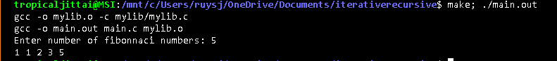
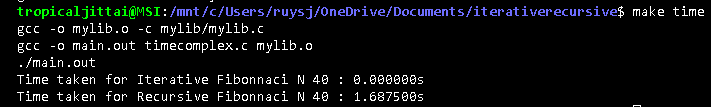
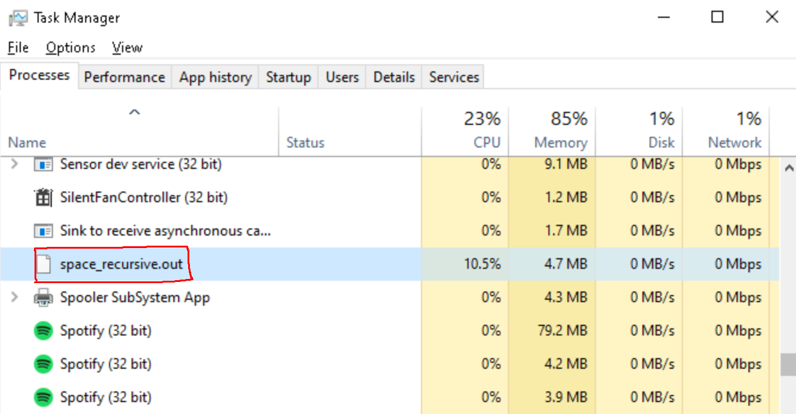

# Fibonacci

Here, i will compare the time and space complexity of fibonacci(iterative) and fibonacci(recursive)

## Fibonacci iterative

```c
int fibonacciIterative(int N){
    int first = 0, second = 1, result, i;
    for (int i = 0; i < N+1; i++)
  {
    if (i <= 1){
        result = i;
    }
    else
    {
      result = first + second;
      first = second;
      second = result;
    }
}
return result;
}
```

## Fibonacci recursive

```c
int fibonacciRecursive(int N){
    
    if (N==0){
        return 0;
    }
    else if (N==1){
        return 1;
    }
    else{
        return fibonacciRecursive(N-1)+fibonacciRecursive(N-2);
    }
}
```

# Testing

## How to run

Using command make; ./main.out

```bash
make; ./main.out
```

## Result



# Benchmark

Benchmarking is to test of code and help us improve our code by comparing each approach's time and space complexity.

# Time Complexity

## How to run

using command make time

```bash
make; make time
```

## Time Comparison

In this case i use N = 40

it shows that the time taken for iterative N = 40 is 0.000000s and for recursive N = 40 us 1.687500s

# Space Complexity

## How to run

```bash
make; make space
./space_recursive.out
```

```bash
make; make space
./space_iterative.out
```

## Space Comparison

(using activity monitor)

N = 100000

It shows that the memory usage for iterative is 0.1 mb and memory usage by recursive is 4.7 mb
