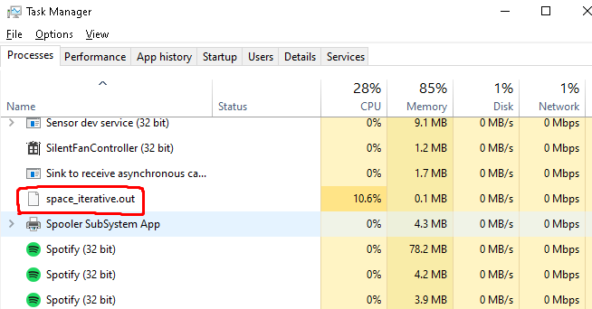

# Fibonacci

For this assignment, i will compare the time & space complexity of fibonacci iterative method and fibonacci recursive method

## Fibonacci iterative

```c
int fibonacciIterative(int N){
    int first = 0, second = 1, result, i;
    for (int i = 0; i < N+1; i++)
  {
    if (i <= 1){
        result = i;
    }
    else
    {
      result = first + second;
      first = second;
      second = result;
    }
}
return result;
}
```

## Fibonacci recursive

```c
int fibonacciRecursive(int N){
    
    if (N==0){
        return 0;
    }
    else if (N==1){
        return 1;
    }
    else{
        return fibonacciRecursive(N-1)+fibonacciRecursive(N-2);
    }
}
```

# Code testing

## How to run the code

Using command make; ./main.out

```bash
make; ./main.out
```

## Results


# Benchmark results

The point of benchmarking is for us to test our code, it will help us see the time and space complexity, and their advantages & weaknesses.

# Time Complexity

## How to run time complexity tests

using command make time

```bash
make; make time
```

## Time  Result Comparison

For the test in this case i will use N = 40


This picture above shows that the time needed for iterative N = 40 is 0.000000s and for recursive N = 40 is 1.687500s

# Space Complexity Results

## How to run space complexity tests

```bash
make; make space
./space_recursive.out
```

```bash
make; make space
./space_iterative.out
```

## Space Complexity Comparison

(using task manager)

N = 100000




Images above shows that the memory usage for iterative is 0.1 mb and memory usage by recursive is 4.7 mb
